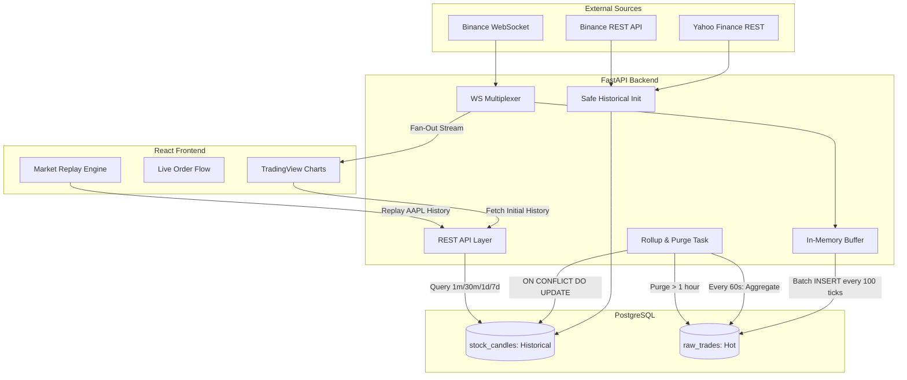

# 📈 TickStream — Real-Time Market Data Ingestion & Time-Series Pipeline

A production inspired realtime market data platform that ingests live Binance trade events over WebSockets, buffers and batch-writes raw ticks into PostgreSQL, continuously materializes 1-minute OHLCV aggregates, and serves both live and historical market data through REST and WebSocket APIs.

The project focuses on **non-blocking ingestion, buffered persistence, incremental aggregation, conflict-safe writes, data retention, and multi-resolution time-series querying**, with a React trading terminal used as the visualization layer.


### At a Glance

|                        |                                                                           |
| ---------------------- | ------------------------------------------------------------------------- |
| **Live Source**        | Binance WebSocket trade stream                                            |
| **Historical Sources** | Yahoo Finance + Binance REST APIs                                         |
| **Ingestion**          | Async Python + WebSockets                                                 |
| **Persistence**        | PostgreSQL                                                                |
| **Raw Data**           | Batched tick inserts                                                      |
| **Aggregation**        | SQL-based 1-minute OHLCV rollups                                          |
| **Retention**          | Raw ticks retained for 1 hour; aggregates retained for historical queries |
| **Serving**            | FastAPI REST + WebSocket                                                  |
| **Visualization**      | React + TradingView Lightweight Charts                                    |
| **Deployment**         | Docker Compose / Render / Vercel / Supabase                               |

**Data Flow:**
`Binance WebSocket → Async ingestion → Buffered PostgreSQL writes → 1-minute rollups → Historical time-series → REST/WebSocket serving`

---

## 🧠 Architecture Overview

Live raw ticks are ingested into a hot store, aggregated into a historical store, and then purged to optimize disk I/O and storage.



---

## 🏆 Engineering Highlights

### 1. Real-Time Ingestion
*   **Buffered Persistence:** Accumulates 100 ticks in memory before issuing a bulk PostgreSQL insert, reducing database round trips and write overhead while keeping the WebSocket event loop responsive.
*   **Non-Blocking I/O:** Offloads synchronous database bulk-inserts and rollup queries to background threads using `asyncio.to_thread`, ensuring the fast-paced WebSocket event loop never blocks on disk I/O.

### 2. Data Lifecycle & Retention
*   **Automated Data Tiering:** A background `asyncio` task runs every 60 seconds. It rolls up the previous minute’s raw ticks into the historical table, then executes a `DELETE` purge on raw ticks older than 1 hour.
*   **Bounded Storage:** This architecture caps the high-velocity raw tick table at ~6MB while preserving long-term historical aggregates for queries.

### 3. Correctness & Conflict-Safety
*   **Conflict-Safe Rollups:** The 1-minute OHLCV rollup uses an `ON CONFLICT (ticker, datetime) DO UPDATE` upsert mechanism, making repeated rollup executions safe and preventing duplicate aggregates.
*   **Safe Historical Initialization:** On server boot, a startup hook checks database state. If empty, it automatically fetches and seeds 7 months of historical data via chunked REST API calls, using unique constraints to avoid duplicating already-materialized data.

### 4. Query Serving & Aggregation
*   **Multi-Resolution Time-Series:** API logic uses `DATE_TRUNC` and epoch math to dynamically aggregate 1-minute base data into 30m, 1d, and 7d candles on demand.
*   **Window Functions:** Uses SQL window functions (`FIRST_VALUE`, `LAST_VALUE` with `ROWS BETWEEN UNBOUNDED PRECEDING AND UNBOUNDED FOLLOWING`) to derive OHLCV candles from raw trades.

### 5. WebSocket Multiplexing
*   **Fan-Out Architecture:** Maintains a single upstream Binance connection and fans out received ticks to N connected clients, avoiding one upstream connection per frontend client and preventing upstream API rate-limiting.

### 6. Visualization Layer
*   **Trading Terminal:** A dark-mode React dashboard using TradingView Lightweight Charts.
*   **Market Replay Engine:** For static assets (AAPL), the frontend uses a local `setInterval` loop to sequentially feed historical REST data to the chart at 50ms intervals, simulating a live market.

---

## ⚙️ System Characteristics

| Metric                        | Configuration   |
| ----------------------------- | --------------- |
| Incoming trade rate           | 50–500 msgs/sec |
| Batch size                    | 100 ticks       |
| Aggregation interval          | 60 sec          |
| Raw retention                 | 1 hour          |
| Historical seed               | 7 months        |
| API aggregation levels        | 1m / 30m / 1d / 7d |

---

## 🔐 Reliability & Correctness

*   Upstream disconnects are handled by reconnecting the Binance WebSocket consumer.
*   Database writes are decoupled from the WebSocket event loop.
*   Aggregated candles use conflict-safe upserts to make repeated rollup execution safe.
*   Raw ticks are retained for a bounded period while historical aggregates remain queryable.
*   Startup seeding avoids duplicating already-materialized historical data.

---

## ⚠️ Failure & Trade-offs

The in-memory buffer reduces database write overhead and keeps the ingestion loop responsive, but ticks that have not yet been flushed can be lost if the process crashes.

A production-oriented design could introduce a durable event log such as Kafka, allowing consumers to replay events after failures. End-to-end exactly-once processing would additionally require appropriate consumer offset management and an idempotent or transactional sink.

---

## 🛠 Tech Stack

| Layer | Technologies |
| :--- | :--- |
| **Backend** | Python, FastAPI, Uvicorn, WebSockets, SQLAlchemy |
| **Database** | PostgreSQL, psycopg2 |
| **Frontend** | React (Vite), Tailwind CSS, Shadcn UI, TradingView Lightweight Charts |
| **DevOps** | Docker, Docker Compose, Render, Vercel, Supabase |

## 💻 Local Setup

### Execution
1. **Clone the repository:**
   ```bash
   git clone https://github.com/flmeHashira/Tick-Stream.git
   cd Tick-Stream
   ```

2. **Create Environment File:**
   Create a `.env` file in the root directory:
   ```env
   POSTGRES_USER=postgres
   POSTGRES_PASSWORD=[password]
   POSTGRES_DB=market
   ```

3. **Start the Backend & Database:**
   This will spin up Postgres, run the schema initialization, start the FastAPI server, and automatically seed 7 months of historical data.
   ```bash
   docker compose up --build
   ```

4. **Start the Frontend:**
   Open a new terminal and navigate to the frontend folder:
   ```bash
   cd frontend
   npm install
   npm run dev
   ```

5. **View the Application:**
   Open your browser and navigate to `http://localhost:5173`.

## 📡 API Reference

### REST Endpoints
*   `GET /api/v1/candles`
    *   **Params:** `asset` (AAPL, BTCUSDT), `interval` (1m, 30m, 1d, 7d)
    *   **Returns:** JSON array of OHLCV candles.
    *   *Example:* `/api/v1/candles?asset=BTCUSDT&interval=1d`

### WebSocket Endpoints
*   `WS /ws/BTC`
    *   **Action:** Opens a live stream connection.
    *   **Pushes:** `{"time": 1721908923000, "price": 65050.23, "quantity": 0.005, "is_buyer_maker": false}`

## ☁️ Deployment (Free Tier)

This project is designed to be hosted for free using a modern cloud-native stack:
1.  **Database:** Supabase (Managed PostgreSQL: 500MB Free Tier).
2.  **Backend:** Render.com (Docker Web Service: Spins down after 15 mins of inactivity).
3.  **Frontend:** Vercel (Vite/React static hosting).

*Note: When deploying, set the `DATABASE_URL` environment variable in Render to the Supabase Connection Pooler URL (port 6543) to ensure IPv4 compatibility.*